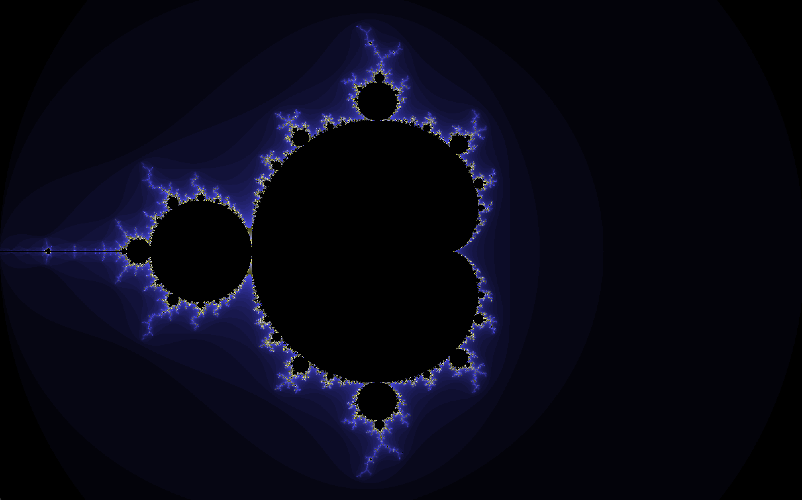
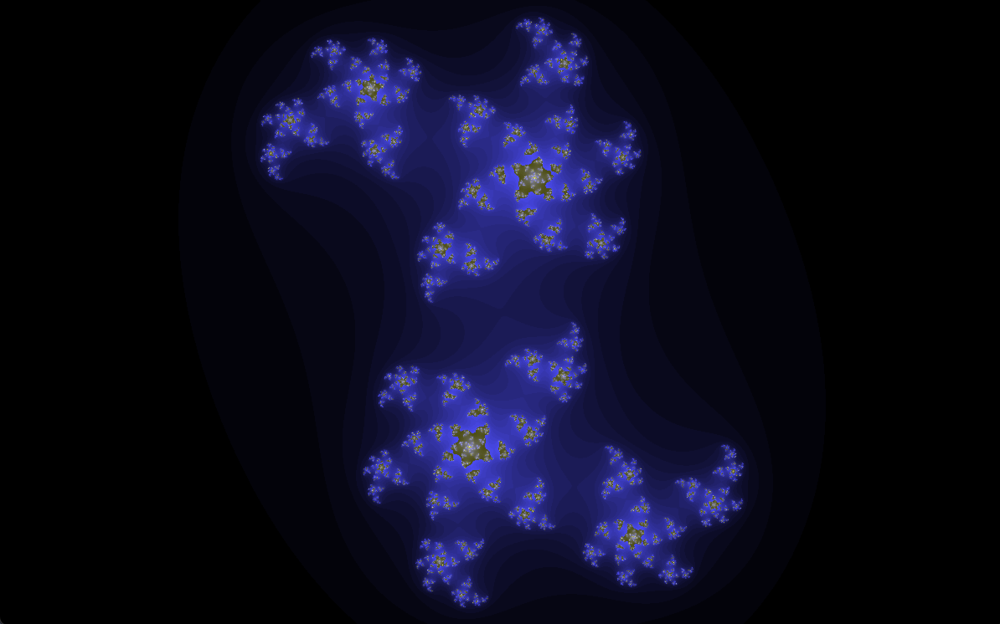

# Fract-ol

A 42 School project that renders beautiful fractals using the MiniLibX graphics library.

## Mandelbrot Set


## Julia Set


---

## Table of Contents
- [Background Concepts](#background-concepts)
  - [Complex Numbers](#complex-numbers)
  - [The Complex Plane](#the-complex-plane)
  - [What Are Fractals?](#what-are-fractals)
  - [The Mandelbrot Set](#the-mandelbrot-set)
  - [The Julia Set](#the-julia-set)
  - [The Escape Time Algorithm](#the-escape-time-algorithm)
- [MiniLibX Concepts](#minilibx-concepts)
- [Usage](#usage)
- [Controls](#controls)

---

## Background Concepts

### Complex Numbers

A **complex number** is a number that has two parts:
- A **real** part
- An **imaginary** part

Written as: `z = a + bi`

Where:
- `a` is the real part
- `b` is the imaginary part
- `i` is the imaginary unit, defined as `i² = -1`

**Examples:**
- `3 + 2i` → real part = 3, imaginary part = 2
- `-1 + 4i` → real part = -1, imaginary part = 4
- `2i` → real part = 0, imaginary part = 2

#### Operations on Complex Numbers

**Addition:**
```
(a + bi) + (c + di) = (a + c) + (b + d)i
```

**Multiplication:**
```
(a + bi) × (c + di) = (ac - bd) + (ad + bc)i
```

**Squaring a complex number:**
```
(a + bi)² = (a² - b²) + (2ab)i
```

This is implemented in the code as:
```c
t_complex square_complex(t_complex z)
{
    // new_x = x² - y²
    // new_y = 2xy
}
```

---

### The Complex Plane

The **complex plane** (also called Argand plane) is a way to visualize complex numbers as points in 2D space:
- **X-axis** = Real part
- **Y-axis** = Imaginary part

So the complex number `3 + 2i` would be plotted at coordinates `(3, 2)`.

```
        Imaginary (y)
             ↑
             |
        2i --|----• (3 + 2i)
             |    |
        1i --|    |
             |    |
   -2   -1   0----1----2----3→ Real (x)
             |
       -1i --|
             |
```

This is crucial for fractals because **each pixel on your screen represents a complex number**.

---

### What Are Fractals?

A **fractal** is a mathematical set that exhibits:
- **Self-similarity**: Parts of the fractal look like smaller copies of the whole
- **Infinite complexity**: You can zoom in forever and still see detail
- **Fractional dimension**: They exist between integer dimensions

Fractals are created by repeating a simple mathematical formula over and over (iteration).

---

### The Mandelbrot Set

The **Mandelbrot set** is defined by the formula:

```
z(n+1) = z(n)² + c
```

Where:
- `z` starts at 0
- `c` is the complex number representing the current pixel
- We iterate this formula repeatedly

**The Algorithm:**
1. For each pixel `(x, y)` on screen, create a complex number `c = x + yi`
2. Start with `z = 0`
3. Repeatedly calculate `z = z² + c`
4. Check if `|z| > 2` (the point "escaped")
5. If it escapes, color based on how many iterations it took
6. If it never escapes (after max iterations), color it black (part of the set)

**Why |z| > 2?**
Mathematically proven: if the magnitude of `z` ever exceeds 2, it will escape to infinity. So we use `|z|² > 4` as our escape condition (avoiding the square root for performance).

**Pseudocode:**
```
for each pixel (px, py):
    c.real = scaled_x(px)
    c.imag = scaled_y(py)
    z = 0

    for i = 0 to MAX_ITERATIONS:
        z = z² + c
        if |z|² > 4:
            color = palette[i]
            break

    if didn't escape:
        color = black
```

---

### The Julia Set

The **Julia set** uses the same formula as Mandelbrot:

```
z(n+1) = z(n)² + c
```

**The key difference:**
- In **Mandelbrot**: `c` varies (each pixel), `z` starts at 0
- In **Julia**: `c` is fixed, `z` starts at the pixel coordinates

**The Algorithm:**
1. Choose a fixed complex number `c` (this determines the shape of the Julia set)
2. For each pixel `(x, y)`, set `z = x + yi`
3. Repeatedly calculate `z = z² + c`
4. Apply the same escape logic as Mandelbrot

**Interesting c values to try:**
| c value | Description |
|---------|-------------|
| `0.4 + 0.4i` | Symmetric pattern |
| `-0.7 + 0.27015i` | Classic Julia |
| `-0.8 + 0.156i` | Dendrite |
| `-0.4 + 0.6i` | Rabbit |
| `0.285 + 0.01i` | Spiral |
| `-0.835 - 0.2321i` | Starfish |
| `-0.70176 - 0.3842i` | Elaborate |

---

### The Escape Time Algorithm

The **escape time algorithm** is how we determine colors:

1. **Count iterations** until the point escapes (|z|² > 4)
2. **Map iteration count to color**

```
iterations: 0 -------- MAX_ITERATIONS
            |              |
color:   bright -------- black
```

Points that escape quickly (low iterations) are typically colored brightly.
Points that take longer get progressively darker colors.
Points that never escape are colored black (they're in the set).

**Color mapping example (from the code):**
```c
color = (i * 3) << 16 | (i * 3) << 8 | (i * 10);
// This creates a color gradient based on iteration count
// Red component:   i * 3
// Green component: i * 3
// Blue component:  i * 10
```

---

## MiniLibX Concepts

**MiniLibX** is a simple graphics library for 42 projects.

### Key Concepts:

**1. Connection & Window**
```c
mlx_ptr = mlx_init();              // Initialize connection to display
win_ptr = mlx_new_window(mlx, w, h, "title"); // Create window
```

**2. Images**
Instead of drawing pixel by pixel to the screen (slow), we:
1. Create an image in memory
2. Modify pixels in that image
3. Push the entire image to the window at once

```c
img_ptr = mlx_new_image(mlx, width, height);
pixels = mlx_get_data_addr(img, &bpp, &line_len, &endian);
```

**3. Pixel Manipulation**
Each pixel's memory location:
```c
offset = (y * line_length) + (x * (bits_per_pixel / 8));
*(unsigned int *)(pixels + offset) = color;
```

**4. Event Hooks**
```c
mlx_key_hook(win, key_handler, data);    // Keyboard events
mlx_mouse_hook(win, mouse_handler, data); // Mouse events
mlx_hook(win, 17, 0, close_handler, data); // Window close (X button)
```

**5. The Loop**
```c
mlx_loop(mlx); // Infinite loop that waits for events
```

---

## Usage

```bash
# Compile
make

# Run Mandelbrot
./fractol mandelbrot

# Run Julia with custom c value
./fractol julia <real> <imaginary>

# Julia examples:
./fractol julia 0.4 0.4
./fractol julia -0.7 0.27015
./fractol julia -0.8 0.156
./fractol julia 0.285 0.01
```

---

## Controls

| Key/Action | Function |
|------------|----------|
| `Scroll Up` | Zoom in |
| `Scroll Down` | Zoom out |
| `ESC` | Exit program |

---

## Mathematical Summary

| Aspect | Mandelbrot | Julia |
|--------|------------|-------|
| Formula | z = z² + c | z = z² + c |
| z initial | 0 | pixel coordinates |
| c value | pixel coordinates | fixed parameter |
| Result | One fractal | Family of fractals |

---

## References

- Mandelbrot, B. B. (1980). *Fractal aspects of the iteration of z → λz(1 − z) for complex λ and z*. Annals of the New York Academy of Sciences, 357(1), 249-259.

- Douady, A., & Hubbard, J. H. (1984). *Étude dynamique des polynômes complexes* (Partie I). Publications Mathématiques d'Orsay.

- Peitgen, H. O., & Richter, P. H. (1986). *The Beauty of Fractals: Images of Complex Dynamical Systems*. Springer-Verlag.

- Falconer, K. (2003). *Fractal Geometry: Mathematical Foundations and Applications* (2nd ed.). John Wiley & Sons.

- Devaney, R. L. (1989). *An Introduction to Chaotic Dynamical Systems* (2nd ed.). Addison-Wesley.

- Julia, G. (1918). *Mémoire sur l'itération des fonctions rationnelles*. Journal de Mathématiques Pures et Appliquées, 8, 47-245.

---

*Project by azkaraka @ 42 Istanbul*
